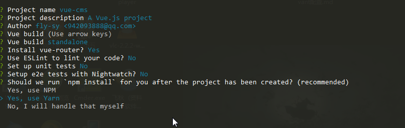

# vue-cli 快速构建vue项目    

##  一、前期准备工作   

1. 安装nodejs  

    直接去官方网站下载最新的nodejs http://nodejs.org 下载好之后下一步下一步安装既可

2. 查看nodejs和npm的版本  

    node -v   

    npm -v 

## 二、安装vue-cli   

1. 全局安装vue-cli 

​      npm i vue-cli -g   

2. 查看版本  

    vue -V (大写的V)

3. 在桌面初始化项目   （shift + 鼠标右键 ，在此处打开命名窗口，有的是powershell）

    vue init webpack 项目名称 (项目的名称不要使用大写) 

    如： 

    vue init webpack vue-cms  

4. 确认需要安装需求

    

## 三、安装vue移动端ui  ***vant***

### 完整引入方式  

1. 安装vant   

    npm i vant -S

2. 在main.js文件中导入所有的组件  

    ```
        import Vue from 'vue';
        import Vant from 'vant';
        import 'vant/lib/index.css';

        Vue.use(Vant);

    ```

### 按需引入方式 

1. 安装  babel-plugin-import 

    npm i  babel-plugin-import -D   

2. 在.babelrc文件中   

    ```
        {
            "plugins": [
                ["import", {
                "libraryName": "vant",
                "libraryDirectory": "es",
                "style": true
                }]
            ]
        }
    ps: 可能配置完这个文件之后 npm run dev 会报  webpack-dev-server的错误，这个时候直接把node_modules文件删除重新npm i 安装包 
    ```


3. 在main.js 文件中按需引入组件

    ```
        import { Button, Cell } from 'vant';

        Vue
            .use(Button)
            .use(Cell)

    ```